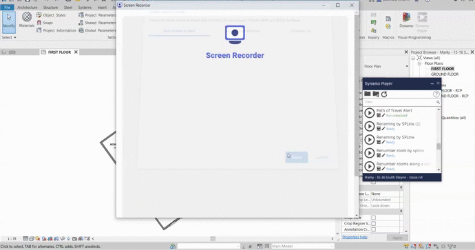

# Revit-Path-Travel-Alert
Dynamo script to check exit travel paths

Inputs:
-"Select Exit (Model element)"
-"Distance"
-"View"

Outputs:
-Travel path in green < Distance
-Travel path in Red > Distance

